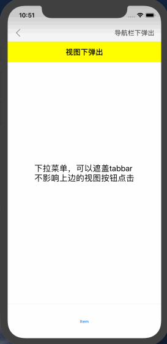

# JHDropDownView
实现导航栏下方下拉菜单，可以遮盖住tabbar，但是遮盖上方的视图以及导航栏不影响点击。



##API
```
//弹出遮罩
+ (void)coverTabbar:(UIView *)contentView       ///需要弹出的菜单视图
              fromY:(CGFloat)fromY              ///菜单弹出的起始坐标
           canClick:(BOOL)canClick              ///是否能点击蒙版收起
          showBlock:(dispatch_block_t)showBlock ///已显示的block
          hideBlock:(dispatch_block_t)hideBlock;///隐藏的block
//判断时候已经存在遮罩
+ (BOOL)hasDropDown;
/**
 隐藏视图
 */
+ (void)hideDropDown;

```
##使用方法
```
使用方法，弹出下拉菜单前可以先判断是否存在

    if ([JHDropDownView hasDropDown]) {
        [JHDropDownView hideDropDown];
        return;
    }
    
初始化一个你需要弹出来的菜单并设置size

    UIView *imgView = [[UIView alloc] init];
    imgView.backgroundColor = [UIColor cyanColor];
    imgView.jh_size = CGSizeMake(SCREEN_WIDTH, 300);
    
使用类方法展示遮盖，并且回调给两个block方便执行你的操作，也可以不用

    [JHDropDownView coverTabbar:imgView fromY:起点坐标Y canClick:YES
                      showBlock:^{
                          NSLog(@"show");
                      }
                      hideBlock:^{
                          NSLog(@"hide");
                      }];

```

```
##  安装
### 1.手动添加:<br>
*   1.将 JHDropDownView 文件夹添加到工程目录中<br>
*   2.导入 JHDropDownView.h

### 2.CocoaPods:<br>
*   1.在 Podfile 中添加 pod 'JHDropDownView'<br>
*   2.执行 pod install 或 pod update<br>
*   3.导入 JHDropDownView.h


##  许可证
JHDropDownView 使用 MIT 许可证，详情见 LICENSE 文件
